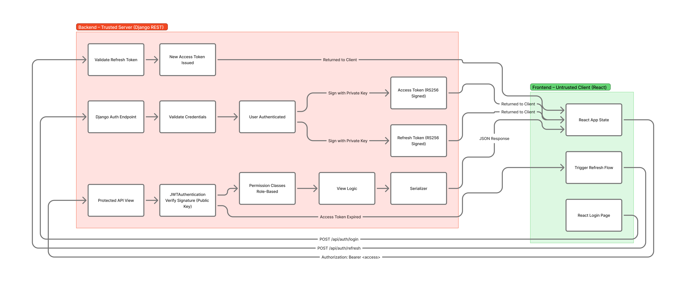
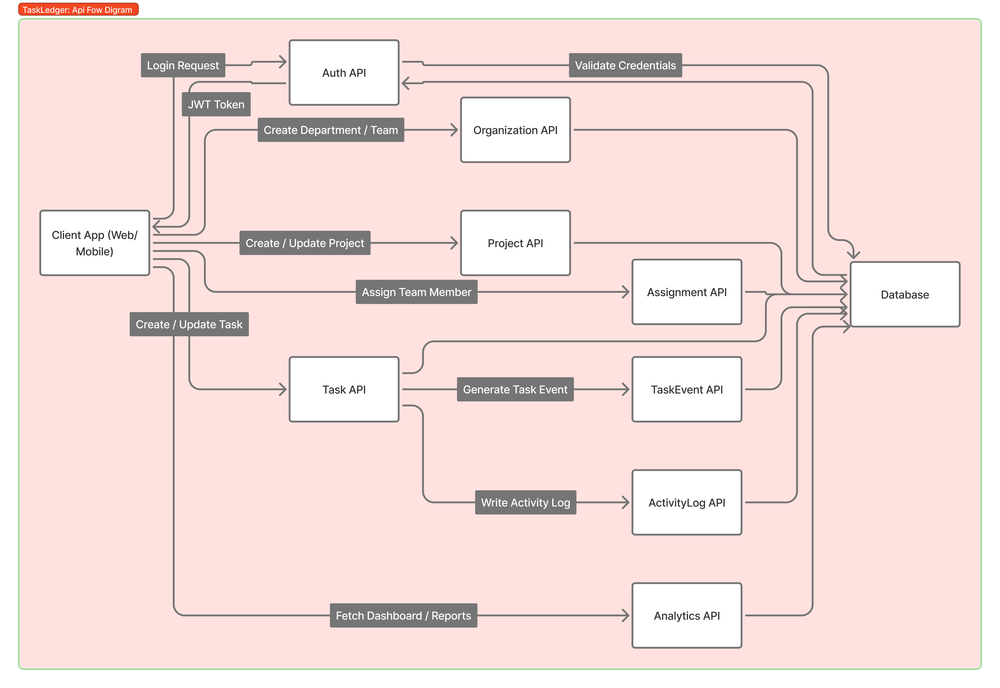

# TaskLedger – Workforce Performance & Task Analytics Platform

## 📄 Project Description

**TaskLedger** is a modular workforce management system designed to track tasks, time-based activities, and performance metrics across employees, teams, and departments.

The platform focuses on **structured task execution**, **event-driven time tracking**, and **analytics-ready data modeling**, making it suitable for enterprise environments and data-driven performance evaluation.

This repository currently contains:
- Finalized **system architecture & ER design**
- Branding and UI direction
- Planned frontend and backend module structure
- **Implemented backend APIs for Department management** (list, create, retrieve, and toggle `is_active`)

Backend implementation will be developed incrementally using a clean, scalable design approach.

---
## 🎯 Core Objectives

- Centralized task and project management  
- Accurate event-based tracking of work activity  
- Role-based access for Admins, Managers, and Employees  
- Analytics-ready data for productivity insights  
- Clean separation between domain modules  

---

## 🧱 High-Level Architecture

### Frontend
- React (manual implementation planned)
- Homepage with product overview and login entry
- Dashboard UI (future scope)

### Backend
- Django + Django REST Framework
- Modular app-based architecture
- Event-driven task tracking
- **Department API implemented with JWT + RBAC**  

### Database
- Relational schema with strict PK/FK relationships
- Designed using ER principles (Eraser.io)

---

# 🗂️ Core Modules & Current Status (Updated)

## **User & Access Control**
- **Custom User model** (email as `USERNAME_FIELD`)
- **Role-based system** (ADMIN, MANAGER, EMPLOYEE)
- **JWT authentication** using RS256
- **Access + Refresh token rotation**
- **Custom role claims** embedded in JWT
- **Protected endpoints** with DRF permission classes
- **Team assignment** with business-rule validation

## **Organization Structure**

### **Department**
- Full CRUD via ViewSet
- **Soft deactivate** via `is_active`
- **Role-restricted modification**

### **Team**
- Fields: `name`, `code`, `department`, `manager`, `created_by`, `is_activate`
- **Soft delete** implemented
- **Strict team-manager enforcement**
- User belongs to **exactly one team** (FK design)
- Controlled API for assigning users to teams
- **Permission-restricted updates**

## **Project Management**

### **Project**
- Belongs to a **Team** and **Department**
- **Team manager** automatically becomes project manager
- **Validation** for team–department consistency
- **Status lifecycle** enforced (PLANNED, ACTIVE, etc.)
- **Signals** propagate manager changes safely

### **Assignment**
- Links users to projects
- **Active assignment uniqueness** enforced
- **Role-based restrictions** (only Project Manager or ADMIN can assign)
- **Indexed** for performance
- **Validates** user belongs to project's team

### **Task Management**
- **Task** belongs to project
- **Assigned to team member only**
- **Role-based update restrictions**:
  - **EMPLOYEE** → status only
  - **MANAGER** → full control within project
  - **ADMIN** → unrestricted
- **Nested route** under project
- **Integrity-tested** under team reassignment scenarios

---

**Status: Production-ready core modules complete** 🎉

### ⚠️ Analytics (Planned)
- Event-based aggregation
- Project productivity metrics
- Department and employee performance insights

---

## 🔗 Entity Relationships (Overview)

- **User** belongs to **exactly one Team**
- **Team** belongs to **one Department** 
- **Project** belongs to **one Team**
- **Project** has **many Assignments**
- **Assignment** links **one User** to **one Project**
- **Task** belongs to **one Project**
- **Task** is assigned to **one User**

**Key Constraints:**
- One-to-one team membership per user
- Team-department hierarchy enforced
- Project-team consistency validated
- Active assignment uniqueness

---

## 🌐 GitHub Integration (Planned)

- Each user can **connect their GitHub account** to TaskLedger  
- OAuth-based authentication flow:
  1. User clicks “Connect GitHub” → redirected to GitHub OAuth consent page  
  2. GitHub returns a `code` → exchanged for an access token  
  3. Token stored securely in backend, associated with user  
- Scopes:
  - `repo` → access to private/public repos  
  - `read:user` → read GitHub profile  
  - `read:org` → read organization data if analyzing org contributions  
- Contributions will be calculated from **repos created by the organization**, including private repos  
- **Current development stage:** only the “Connect GitHub” view and token exchange logic are implemented  

---

## 🛠️ Tech Stack

- **Backend:** Django, Django REST Framework  
- **Database:** PostgreSQL  
- **Frontend:** React  
- **Authentication:** JWT + Role-Based Access Control  
- **Design:** Figma, AI-assisted branding tools
---
## Authentication & Authorization (JWT)

The API uses **JWT (JSON Web Tokens)** for stateless authentication. Session-based auth is avoided so the backend does not store server-side session state, which simplifies horizontal scaling, works cleanly with multiple clients (web, mobile, programmatic), and avoids cookie/CSRF concerns for API-only consumers.

- **Access token:** Short-lived credential for authorizing requests. Carried in the `Authorization: Bearer <token>` header.
- **Refresh token:** Long-lived credential used only to obtain a new access token. Not sent with every request; used only against the refresh endpoint.

**Token format & strategy:** Tokens are signed with **RS256** (asymmetric: private key for signing, public key for verification). Access tokens expire in **15 minutes**; refresh tokens in **1 day**. Custom claims include `user_id`, `role`, `username`, and `email` so protected endpoints can authorize without extra DB lookups. Security considerations: tokens are opaque to the client (no sensitive data in payload beyond identifiers and role), HTTPS is required in production, and refresh tokens are rotated on use with optional blacklisting to limit reuse.

### Authentication Flow (Step-by-Step)

1. **Login request** — Client sends `POST /api/auth/login/` with `email` and `password` (JSON).
2. **Credential validation** — Backend validates against the user model (email as `USERNAME_FIELD`). Invalid credentials return 401.
3. **JWT issuance** — On success, backend returns JSON: `access` and `refresh` tokens (and optionally user payload). Access token contains standard claims plus custom claims (e.g. `role`, `user_id`).
4. **Client-side token storage** — Store the access token in memory or a short-lived, secure store for attaching to requests. Store the refresh token in **HTTP-only, Secure, SameSite cookies** (or another secure storage such as secure storage on mobile) so it is not exposed to JavaScript. Never put refresh tokens in `localStorage` if the app is exposed to XSS.
5. **Protected API requests** — Client sends `Authorization: Bearer <access_token>` on each request to protected endpoints. The backend validates the JWT signature and expiry and loads the user from the token claims.
6. **Token refresh** — When the access token expires (e.g. 401 response), client calls `POST /api/auth/refresh/` with the refresh token (in body or cookie). Backend returns a new access token (and, if rotation is enabled, a new refresh token). Old refresh token is invalidated/blacklisted after rotation.
7. **Logout & invalidation** — Client discards the access token. If refresh token rotation with blacklist is enabled, the last-used refresh token is already invalid after a refresh; for explicit logout, call a logout endpoint that blacklists the current refresh token so it cannot be reused.

### JWT Authentication Flow Diagram
  
### Role-Based Access Control (RBAC)

Roles (`ADMIN`, `MANAGER`, `EMPLOYEE`) are stored on the user model and **embedded in JWT claims** at login via a custom token serializer. The backend does not rely only on the token’s role claim for critical decisions: the authenticated user is loaded from the database (by `user_id` from the token), so role changes take effect after the next login or token refresh.

Permission enforcement is done with **DRF permission classes** (e.g. `IsAuthenticated`, custom `IsAdmin`, `IsAdminOrManager`) attached to views. These classes read `request.user.role` (the user instance attached by JWT authentication) and allow or deny access. Middleware is not used for role checks; all role-based authorization is view-level permission checks.

- **ADMIN** — Full access to admin-only views (e.g. user creation with any role).
- **MANAGER** — Access to manager and employee-level views (e.g. create users with EMPLOYEE role).
- **EMPLOYEE** — Access only to views that require `IsAuthenticated` or employee-specific permissions.

### Security Notes

- **Token expiration:** Short-lived access tokens (15 min) limit the window of misuse if a token is leaked. Refresh tokens (1 day) are used only at the refresh endpoint.
- **Refresh token rotation:** When rotation is enabled, each refresh returns a new refresh token and the previous one is invalidated. Optionally, the old refresh token is blacklisted so it cannot be reused. This limits damage from refresh token theft.
- **Protection against token theft:** Rely on HTTPS everywhere; store refresh tokens in HTTP-only (and Secure, SameSite) cookies where possible; avoid exposing refresh tokens to scriptable storage. Rotate and blacklist refresh tokens so a single stolen refresh token has limited use.

---

## 🖼️ Diagrams

### ER Diagram
  
*Relational schema showing PK/FK relationships across all modules.*

### Module Diagram
  
*High-level module interactions between frontend, backend, and database components.*

## API Flow Diagram

---

## 🎨 Branding & UI Direction

- **Logo:** Minimal, professional, productivity-focused  
- **Primary Theme:** Blue-based palette (trust, structure, analytics)  
- **Homepage Design:**  
  - Product introduction  
  - Feature highlights  
  - Login call-to-action  

UI prototyping is handled using **Figma** with AI-assisted design tools.

---

## 📌 Roadmap (High-Level)

1. Backend core setup & authentication 
2. Department API implementation 
3. Task & event tracking APIs  
4. GitHub integration (token exchange view implemented, contribution calculation planned) 
5. Analytics & performance metrics 
6. Frontend dashboard integration 

---

## ⚠️ Scope & Intent

This project is developed as a **serious portfolio / SaaS-style system**, not a tutorial or demo clone.

Features are added **only when they are properly designed, justified, and scalable**.

---

## 📄 License

This project is currently under development. License will be defined once the core system stabilizes.
