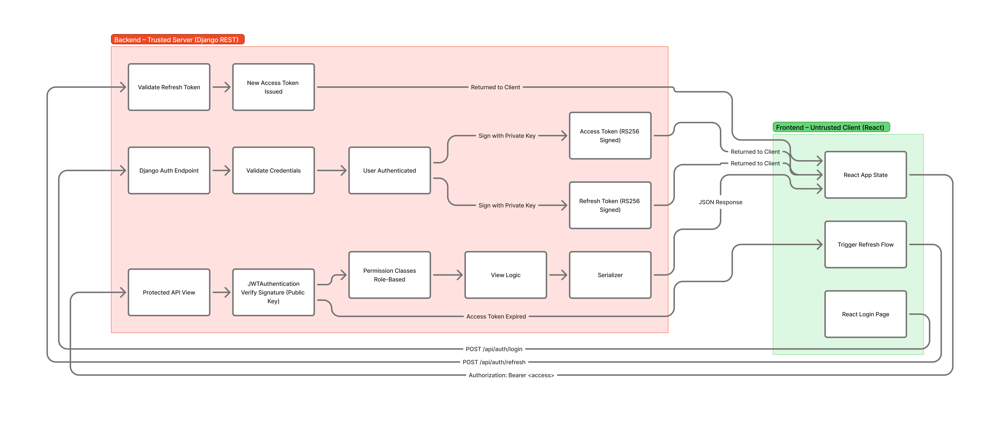
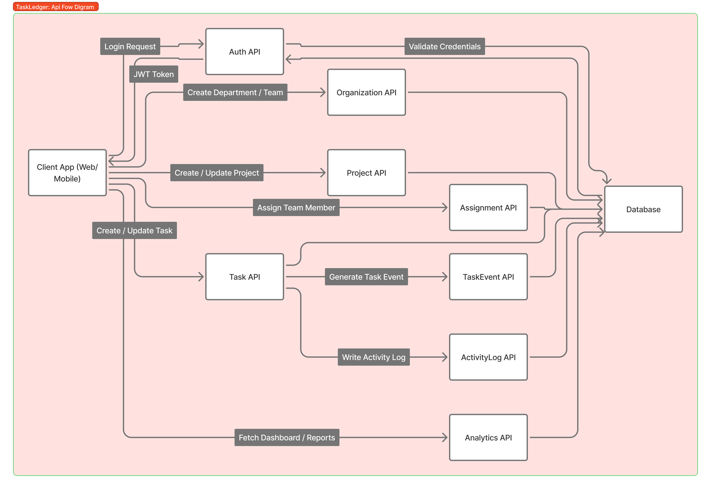

# TaskLedger – Workforce Performance & Task Analytics Platform

## 📄 Project Description

**TaskLedger** is a modular workforce management system designed to track tasks, time-based activities, and performance metrics across employees, teams, and departments.

The platform focuses on **structured task execution**, **event-driven time tracking**, and **analytics-ready data modeling**, making it suitable for enterprise environments and data-driven performance evaluation.

**Current Implementation Status:**

- Finalized **system architecture & ER design**
- **Complete backend implementation** with JWT authentication, RBAC, and comprehensive audit logging
- **Core modules**: Accounts, Organization, Work, Audit, Integrations
- **Frontend development** in progress with React + Vite setup

---

## 🎯 Core Objectives

- Centralized task and project management
- Accurate event-based tracking of work activity
- Role-based access for Admins, Managers, and Employees
- Analytics-ready data for productivity insights
- Clean separation between domain modules

---

## 🧱 High-Level Architecture

### Frontend

- **React 19** with **Vite** build system
- **Tailwind CSS** for styling
- **Framer Motion** for animations
- **React Router DOM** for navigation
- Component-based UI architecture with context management
- Development in progress

### Backend

- **Django + Django REST Framework**
- **Modular app-based architecture** (7 independent modules)
- **JWT Authentication** with RS256 signing
- **Role-Based Access Control (RBAC)** with permission classes
- **Service-oriented design** for business logic
- **Event-driven activity logging** and audit trails
- **Signal-based validation** for data integrity
- **GitHub OAuth integration** for SCM connectivity

### Database

- **SQLite (development)** with support for PostgreSQL
- Relational schema with strict PK/FK relationships
- Designed using ER principles
- Comprehensive indexing for performance optimization

---

# 🗂️ Core Modules & Implementation Status

## **1. Accounts Module**

**User Authentication & Management**

- Custom User model with email-based authentication
- JWT token generation with custom claims (RS256)
- Access + Refresh token rotation mechanism
- Role-based system (**ADMIN**, **MANAGER**, **EMPLOYEE**)
- User creation, read, update endpoints
- Current user context retrieval
- Protected authentication endpoints
- Cloudinary integration for user avatars

**Key Features:**

- Email uniqueness with case-insensitive search
- Custom role claims embedded in JWT tokens
- Avatar upload and management
- PermissionService integration for scoped visibility

---

## **2. Organization Module** ✅

**Department & Team Management**

### **Department**

- Full CRUD via ViewSet (restricted to ADMIN)
- Soft deactivation via `is_active` field
- Automatic `created_by` tracking
- Role-restricted modification
- Department enumeration for team-department consistency validation

### **Team**

- Full CRUD with strict permission controls
- Belongs to exactly one **Department**
- Team **Manager** assignment with validation
- Soft delete via `is_active` flag
- User team assignment service with business-rule enforcement
- Team member enumeration endpoints
- Automatic signal-based validation for manager consistency

**Key Validation Rules:**

- Team manager must exist within the department
- Users can only be assigned to one team
- Department changes are prevented if teams depend on it
- Cascading manager updates across assigned projects

---

## **3. Work Module**

**Projects, Tasks & Assignments**

### **Project**

- Create, read, update endpoints
- Belongs to **Team** and **Department**
- Team manager automatically becomes project manager
- Validation for team–department consistency
- Status lifecycle management (**PLANNED**, **ACTIVE**, **COMPLETED**, **ARCHIVED**)
- Automatic manager change propagation via signals
- Team member enumeration for project

### **Assignment** (User-Project mapping)

- Links users to projects with audit trails
- Active assignment uniqueness enforced
- Role-based restrictions (only Project Manager or ADMIN can assign)
- Database indexing for performance
- Validates user belongs to project's team
- Comprehensive change tracking

### **Task** (Project-based work items)

- Belongs to **Project**
- Assigned to team members only
- Status management (**CREATED**, **IN_PROGRESS**, **COMPLETED**, **BLOCKED**)
- Role-based update restrictions:
  - **EMPLOYEE** → status updates only
  - **MANAGER** → full control within scoped projects
  - **ADMIN** → unrestricted updates
- Nested routing under project
- Validated under team reassignment scenarios
- Comprehensive activity logging on all changes

---

## **4. Audit Module**

**Activity Logging & Compliance**

**Features:**

- Centralized **ActivityLog** system for complete traceability
- Immutable audit trails for all significant actions
- Service-oriented architecture (ActivityLogService)
- Transaction-safe logging with `transaction.on_commit()`
- Structured metadata capture with action/target types
- Pagination and filtering support (20 items per page, max 100)
- Role-based visibility via PermissionService
- Search capabilities across action types and metadata
- Comprehensive ordering and filtering options

**Tracked Actions:**

- Task creation, status changes, property updates, deletion
- Project creation, manager assignment, status changes
- Team creation, user assignments, property changes
- User creation, role assignment, property updates
- Timestamped records with user attribution

---

## **5. Core Permissions Module**

**Role-Based Access Control**

**Components:**

- Custom permission classes:
- `IsAdmin` - Restricted to ADMIN users
- `IsAdminOrTeamManager` - ADMIN or team manager
- `UserPermission` - Flexible user management rules
- `TeamPermission` - Team management rules
- `ProjectPermission` - Project management with scope validation
- `AssignmentPermission` - User-project assignment rules
- `TaskPermission` - Task CRUD with role-based constraints

- **PermissionService** - Centralized permission logic
  - `scope_visible_users` - Filter users by role
  - `scope_departments` - Filter departments by access level
  - `scope_teams` - Filter teams by access level
  - `scope_projects` - Filter projects by user assignment
  - `scope_tasks` - Filter tasks by project and role
  - `scope_activity_logs` - Filter activity logs by visibility

- **BaseScopedViewSet** - Base class enforcing role-based scoping

---

## **6. Integrations Module**

**External Service Integrations**

### **GitHub Integration**

- OAuth 2.0 authorization flow
- User authentication via GitHub
- Session-based CSRF protection
- Redirect URI handling
- GitHub API client connectivity
- Repository linkage pending

---

## **7. Analytics Module**

**Performance & Usage Analytics**

- Foundation laid for productivity metrics
- Pending: Dashboard data aggregation
- Pending: Performance reports

---

## **User & Access Control Summary**

---

**Status: Production-ready core modules complete** 🎉

### ⚠️ Analytics (Planned)

- Event-based aggregation
- Project productivity metrics
- Department and employee performance insights

---

## 🔗 Entity Relationships (Overview)

- **User** belongs to **exactly one Team**
- **Team** belongs to **one Department**
- **Project** belongs to **one Team**
- **Project** has **many Assignments**
- **Assignment** links **one User** to **one Project**
- **Task** belongs to **one Project**
- **Task** is assigned to **one User**

**Key Constraints:**

- One-to-one team membership per user
- Team-department hierarchy enforced
- Project-team consistency validated
- Active assignment uniqueness

---

## 🌐 GitHub Integration (Planned)

- Each user can **connect their GitHub account** to TaskLedger
- OAuth-based authentication flow:
  1. User clicks “Connect GitHub” → redirected to GitHub OAuth consent page
  2. GitHub returns a `code` → exchanged for an access token
  3. Token stored securely in backend, associated with user
- Scopes:
  - `repo` → access to private/public repos
  - `read:user` → read GitHub profile
  - `read:org` → read organization data if analyzing org contributions
- Contributions will be calculated from **repos created by the organization**, including private repos
- **Current development stage:** only the “Connect GitHub” view and token exchange logic are implemented

---

## 🛠️ Tech Stack

- **Backend:** Django, Django REST Framework
- **Database:** PostgreSQL
- **Frontend:** React
- **Authentication:** JWT + Role-Based Access Control
- **Design:** Figma, AI-assisted branding tools

---

## Authentication & Authorization (JWT)

The API uses **JWT (JSON Web Tokens)** for stateless authentication. Session-based auth is avoided so the backend does not store server-side session state, which simplifies horizontal scaling, works cleanly with multiple clients (web, mobile, programmatic), and avoids cookie/CSRF concerns for API-only consumers.

- **Access token:** Short-lived credential for authorizing requests. Carried in the `Authorization: Bearer <token>` header.
- **Refresh token:** Long-lived credential used only to obtain a new access token. Not sent with every request; used only against the refresh endpoint.

**Token format & strategy:** Tokens are signed with **RS256** (asymmetric: private key for signing, public key for verification). Access tokens expire in **15 minutes**; refresh tokens in **1 day**. Custom claims include `user_id`, `role`, `username`, and `email` so protected endpoints can authorize without extra DB lookups. Security considerations: tokens are opaque to the client (no sensitive data in payload beyond identifiers and role), HTTPS is required in production, and refresh tokens are rotated on use with optional blacklisting to limit reuse.

### Authentication Flow (Step-by-Step)

1. **Login request** — Client sends `POST /api/auth/login/` with `email` and `password` (JSON).
2. **Credential validation** — Backend validates against the user model (email as `USERNAME_FIELD`). Invalid credentials return 401.
3. **JWT issuance** — On success, backend returns JSON: `access` and `refresh` tokens (and optionally user payload). Access token contains standard claims plus custom claims (e.g. `role`, `user_id`).
4. **Client-side token storage** — Store the access token in memory or a short-lived, secure store for attaching to requests. Store the refresh token in **HTTP-only, Secure, SameSite cookies** (or another secure storage such as secure storage on mobile) so it is not exposed to JavaScript. Never put refresh tokens in `localStorage` if the app is exposed to XSS.
5. **Protected API requests** — Client sends `Authorization: Bearer <access_token>` on each request to protected endpoints. The backend validates the JWT signature and expiry and loads the user from the token claims.
6. **Token refresh** — When the access token expires (e.g. 401 response), client calls `POST /api/auth/refresh/` with the refresh token (in body or cookie). Backend returns a new access token (and, if rotation is enabled, a new refresh token). Old refresh token is invalidated/blacklisted after rotation.
7. **Logout & invalidation** — Client discards the access token. If refresh token rotation with blacklist is enabled, the last-used refresh token is already invalid after a refresh; for explicit logout, call a logout endpoint that blacklists the current refresh token so it cannot be reused.

### JWT Authentication Flow Diagram

### Role-Based Access Control (RBAC)

Roles (`ADMIN`, `MANAGER`, `EMPLOYEE`) are stored on the user model and **embedded in JWT claims** at login via a custom token serializer. The backend does not rely only on the token’s role claim for critical decisions: the authenticated user is loaded from the database (by `user_id` from the token), so role changes take effect after the next login or token refresh.

Permission enforcement is done with **DRF permission classes** (e.g. `IsAuthenticated`, custom `IsAdmin`, `IsAdminOrManager`) attached to views. These classes read `request.user.role` (the user instance attached by JWT authentication) and allow or deny access. Middleware is not used for role checks; all role-based authorization is view-level permission checks.

- **ADMIN** — Full access to admin-only views (e.g. user creation with any role).
- **MANAGER** — Access to manager and employee-level views (e.g. create users with EMPLOYEE role).
- **EMPLOYEE** — Access only to views that require `IsAuthenticated` or employee-specific permissions.

### Security Notes

- **Token expiration:** Short-lived access tokens (15 min) limit the window of misuse if a token is leaked. Refresh tokens (1 day) are used only at the refresh endpoint.
- **Refresh token rotation:** When rotation is enabled, each refresh returns a new refresh token and the previous one is invalidated. Optionally, the old refresh token is blacklisted so it cannot be reused. This limits damage from refresh token theft.
- **Protection against token theft:** Rely on HTTPS everywhere; store refresh tokens in HTTP-only (and Secure, SameSite) cookies where possible; avoid exposing refresh tokens to scriptable storage. Rotate and blacklist refresh tokens so a single stolen refresh token has limited use.

---

## 🖼️ Diagrams

### ER Diagram

  
_Relational schema showing PK/FK relationships across all modules._

### Module Diagram

  
_High-level module interactions between frontend, backend, and database components._

## API Flow Diagram

---

## 🎨 Branding & UI Direction

- **Logo:** Minimal, professional, productivity-focused
- **Primary Theme:** Blue-based palette (trust, structure, analytics)
- **Homepage Design:**
  - Product introduction
  - Feature highlights
  - Login call-to-action

UI prototyping is handled using **Figma** with AI-assisted design tools.

---

## 📌 Roadmap (High-Level)

1. Backend core setup & authentication
2. Department API implementation
3. Task & event tracking APIs
4. GitHub integration (token exchange view implemented, contribution calculation planned)
5. Analytics & performance metrics
6. Frontend dashboard integration

---

## ⚠️ Scope & Intent

This project is developed as a **serious portfolio / SaaS-style system**, not a tutorial or demo clone.

Features are added **only when they are properly designed, justified, and scalable**.

---

## 📄 License

This project is currently under development. License will be defined once the core system stabilizes.
